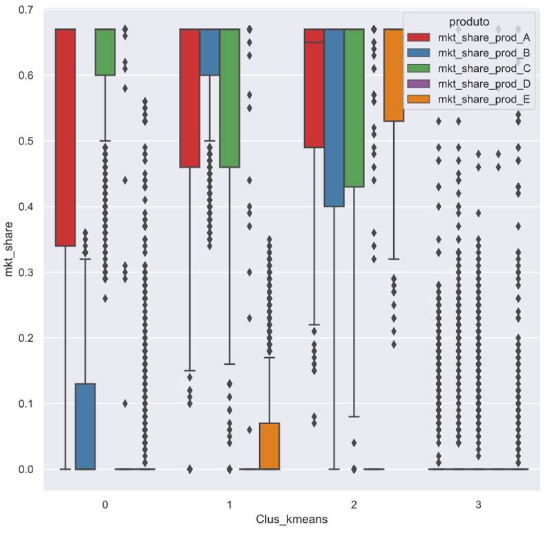
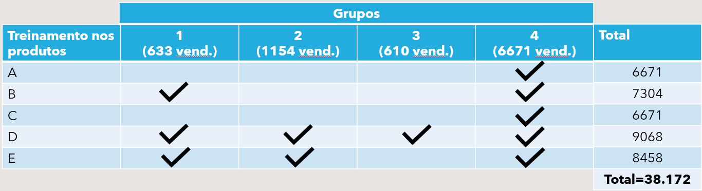

<!-- README.md is generated from README.Rmd. Please edit that file -->

```{r, include = FALSE}
knitr::opts_chunk$set(
  collapse = TRUE,
  comment = "#>"
)
```

# Estratégia de treinamento para vendedores

Claudio Satio Amadatsu

Eliana Eriko Amadatsu Ozaki

Maio/2021

**Problema:** A empresa apresenta Market share baixo em muitos locais de venda, para os seus produtos A, B, C, D e E.

**Fonte de dados:** A base foi comprada da Nielsen, e apresenta o Market share em 9068 locais, para cada um dos 5 produtos

**Objetivo:** Criar uma estratégia de treinamento para os vendedores, para atuação junto aos locais de venda visando aumentar a participação desses produtos em suas prateleiras.


**Resultados de agrupamento em 4 grupos**

Características dos grupos:

**Grupo 1: 633 locais**

Bom nos produtos A e C
Baixo nos produtos B, D e E

**Grupo 2: 1154 locais**

Bom nos produtos A, B e C
Baixo nos produtos D e E

**Grupo 3: 610 locais**

Bom nos produtos A, B, C e E
Baixo no produto D

**Grupo 4: 6671 locais**

Baixo em todos os produtos


```{r,out.width=600 , echo = FALSE, message=FALSE }
 
```

**Estratégia proposta**

```{r,out.width=600 , echo = FALSE, message=FALSE }
 
```

Treinamento produto A: aplicar nos vendedores do grupo 4 

Treinamento produto B: aplicar nos vendedores dos grupos 1 e 4 

Treinamento produto C: aplicar nos vendedores do grupo 4 

Treinamento produto D: aplicar nos vendedores de todos os grupos

Treinamento produto E: aplicar nos vendedores dos grupo 1, 2 e 4


Sem agrupamentos = 45.340 treinamentos

**Melhor agrupamento =  4 grupos (Total de treinamentos = 38.172)**


<!-- badges: start -->
<!-- badges: end -->

