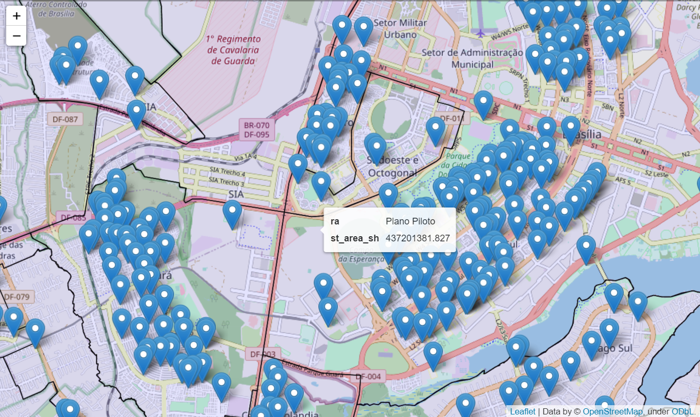
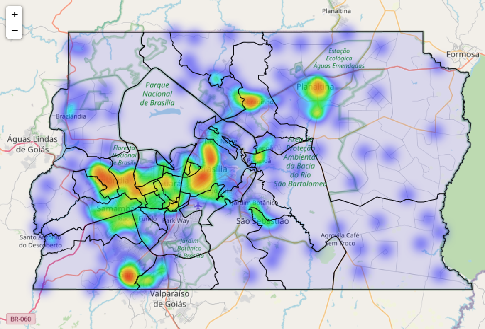
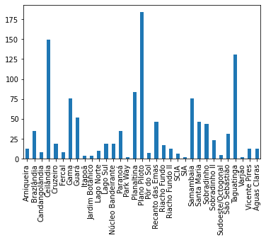

<!-- README.md is generated from README.Rmd. Please edit that file -->

```{r, include = FALSE}
knitr::opts_chunk$set(
  collapse = TRUE,
  comment = "#>"
)
```

# Estudo de escolas e distritos do DF

Claudio Satio Amadatsu

Maio/2021


**Fonte de dados:** 

escolas = gpd.read_file('Mapas/Escolas.shp')

regioesadministrativas = gpd.read_file('Mapas/RegioesAdministrativas.shp')

**Visualização das escolas e dos distritos**

```{r,out.width=600 , echo = FALSE, message=FALSE }
 
```


**Visualização do padrão aglomerado das escolas**

```{r,out.width=600 , echo = FALSE, message=FALSE }
 
```

**Contagem de escolas por região administativa**

```{r,out.width=600 , echo = FALSE, message=FALSE }
 
```


<!-- badges: start -->
<!-- badges: end -->

