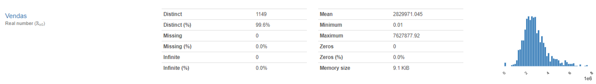
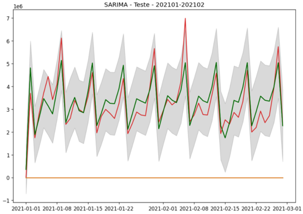

<!-- README.md is generated from README.Rmd. Please edit that file -->

```{r, include = FALSE}
knitr::opts_chunk$set(
  collapse = TRUE,
  comment = "#>"
)
```

# Previsão de vendas varejo

Claudio Satio Amadatsu

Eliana Eriko Amadatsu Ozaki

Abril/2021

**Objetivo**

- Fazer a previsão de vendas diárias de um departamento de uma grande loja

- Dados do departamento analisado (depto 2)

  Vendas registradas por dia de 02/jan/2018 a 28/fev/2021

  Dados adicionais:

  Indicação se a data é dia de pagamento, dia de vale ou feriado

```{r,out.width=800 , echo = FALSE, message=FALSE }
 
```

**Resultados**

Modelo SARIMAX 

Resultados na base Holdout (predito em verde): **R2:   0.757**

```{r,out.width=600 , echo = FALSE, message=FALSE }
 
```


<!-- badges: start -->
<!-- badges: end -->

