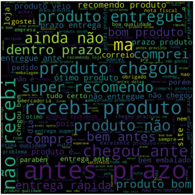

<!-- README.md is generated from README.Rmd. Please edit that file -->

```{r, include = FALSE}
knitr::opts_chunk$set(
  collapse = TRUE,
  comment = "#>"
)
```

# Avaliar se os reviews da base oList são positivos ou negativos

Claudio Satio Amadatsu

Março/2021


**Wordcloud:** 


```{r,out.width=600 , echo = FALSE, message=FALSE }
 
```


**Resultados **

Na base de dados, os reviews têm suas notas de 1 a 5. O modelo foi elaborado para determinar se o review é positivo (satisfeito=1) ou não (satisfeito=0).

Melhor resultado obtido com algoritmo TF-IDF Vectorizer, utilização de modelo classificador SVM.

Primeiros 50 registros dos resultados na base de teste:

```{r , message=FALSE, warning=FALSE }
library(tidyverse)
library(readxl)
reviews <- read.csv(file = 'text_mining_oList.csv', stringsAsFactors = TRUE,sep = ";")
top50 <- head(reviews,50)
knitr::kable(top50)
```


<!-- badges: start -->
<!-- badges: end -->

